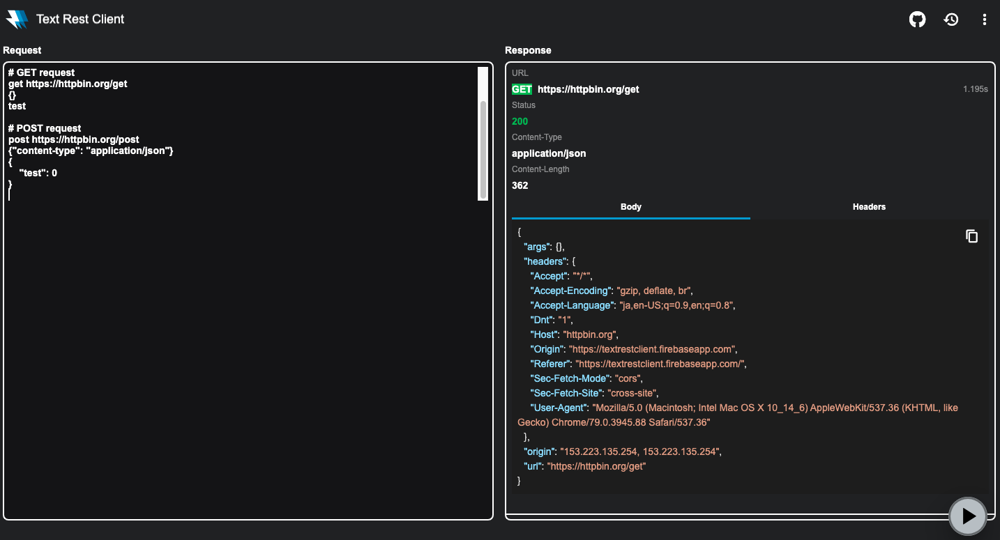

# Text Rest Client


Text Rest Client is a REST client, built on top of Flutter.



## Features

- Send multiple requests from text or selected text

### Methods

- GET
- HEAD
- POST
- PUT
- DELETE
- CONNECT
- OPTIONS
- TRACE
- PATCH

## Example

```
# GET Example
get https://httpbin.org/get
{}
test

# POST Example
post https://httpbin.org/post
{"content-type": "application/json"}
{
    "test": 0
}
```

## TODO :construction:

- [ ] Add Code highlight to text editor
- [ ] Add Request history
- [ ] Add Collection
- [ ] Add Environment variable
- [ ] Offline support(PWA)
- [ ] Support Android
- [ ] Support MacOS
- [ ] Support Windows
